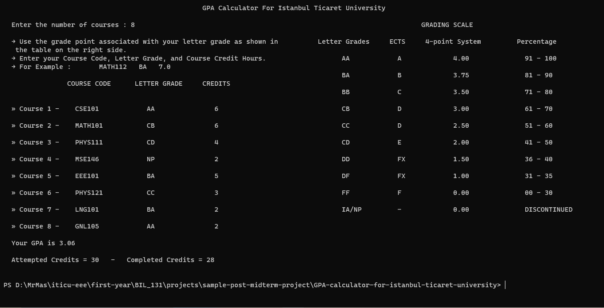

# GPA Calculator for Istanbul Ticaret University
This project is a GPA calculator for Istanbul Ticaret University's grading system. The code calculates the GPA based on the grades received in various courses and prints the results in a table on the console.

## Features
- Calculates the GPA based on Istanbul Ticaret University's grading system.
Prints a table on the console, showing the university's grading system, compared to the ECTS and percentage system.

## User-friendly interface.
- The program is implemented in C, so it's lightweight, fast, and efficient.

## How to use
- Download the source code and compile it using a C compiler.
Run the program and enter the number of courses you have taken.
For each course, enter the course name, credit hours, and letter grade received.
The program will calculate your GPA and print the results on the console.

## Example
*Number of courses:* **3**

**Course 1:**
***code = MATH121***
***Grade: AA***
***Credit hours: 7***

**Course 2:**
***Code: CSE121***
***Grade: BB***
***Credit hours: 5***

**Course 3:**
***Name: CHEM122***
***Grade: CC***
***Credit hours: 4***

## GPA = 3.47

| Grade | GPA  | ECTS Grade | Percentage |
|-------|------|------------|------------|
| AA    | 4.00 | A          | 91-100     |
| BA    | 3.75 | B          | 81-90      |
| BB    | 3.50 | C          | 71-80      |
| CB    | 3.00 | D          | 61-70      |
| CC    | 2.50 | D          | 51-60      |
| CD    | 2.00 | E          | 41-50      |
| DD    | 1.50 | FX         | 36-40      |
| DF    | 1.00 | FX         | 31-35      |
| FF    | 0.00 | F          | 00-30      |
| IA    | 0.00 | -          | -          |

see page 5 of [LINK](.idea/ISTANBUL-TICARET-UNIVERSITESI-ONLISANS-VE-LISANS-EGITIM-OGRETIM-VE-SINAV-YONETMELIGI.pdf) for the table above.
### Note
- **Please be aware that the program is designed to work with Istanbul Ticaret University's grading system only and it may not be accurate for other universities or grading systems.**